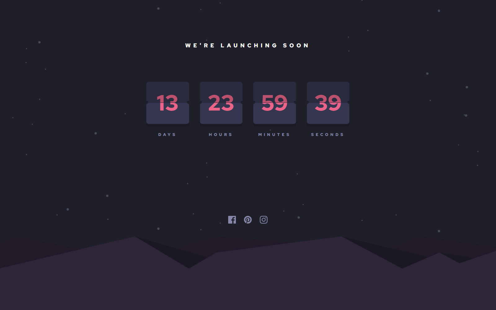

# Frontend Mentor - Launch countdown timer solution

This is a solution to the [Launch countdown timer challenge on Frontend Mentor](https://www.frontendmentor.io/challenges/launch-countdown-timer-N0XkGfyz-). Frontend Mentor challenges help you improve your coding skills by building realistic projects. 

## Table of contents

- [Overview](#overview)
  - [The challenge](#the-challenge)
  - [Screenshot](#screenshot)
  - [Links](#links)
- [My process](#my-process)
  - [Built with](#built-with)
- [Author](#author)

## Overview

### The challenge

Users should be able to:

- ✔️ See hover states for all interactive elements on the page
- ✔️ See a live countdown timer that ticks down every second (start the count at 14 days)
- ✔️ **Bonus**: When a number changes, make the card flip from the middle

### Screenshot

### Links

- Solution URL: [On Frontend Mentor](https://www.frontendmentor.io/challenges/launch-countdown-timer-N0XkGfyz-/hub/launch-countdown-timer-main-react-scss-bem-W_CoSHoSQJ)
- Live Site URL: [On Netlify](https://bqardi-launch-countdown-timer-main.netlify.app/)
- The code: [On Github](https://github.com/frontend-mentor-tasks/launch-countdown-timer-main)

## My process

### Built with

- Semantic HTML5 markup
- SCSS / SASS
- Responsive, simple media query
- [React](https://reactjs.org/) - JS library

## Author

- Website - [Sune Seifert](https://bqardi.dk)
- Frontend Mentor - [@bqardi](https://www.frontendmentor.io/profile/bqardi)
